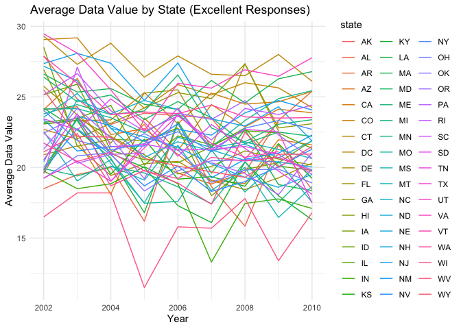
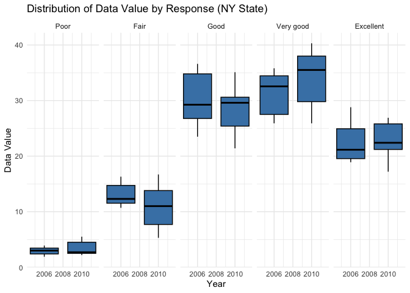
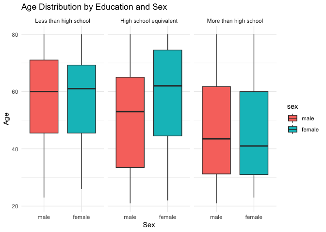

p8105_hx3_jx562
================
Jingyi
2023-10-11

``` r
library(tidyverse)
```

## Problem 1

This problem aims to explore `instacart` data.

First, we loaded the data `instacart`.

``` r
library(p8105.datasets)
data("instacart")
```

The data `instacart` has features as described below.

- The data has 15 observations and 1384617 variables.
- The data has variables named order_id, product_id, add_to_cart_order,
  reordered, user_id, eval_set, order_number, order_dow,
  order_hour_of_day, days_since_prior_order, product_name, aisle_id,
  department_id, aisle, department.
- There are 134 diffrent aisles, whose `aisle_id` range from 1 to 134.
- There are 39123 different product.
- Overall, the `order_number` ranges from 4 to 100 with a mean 17.09
- An example of the observations of the data is demonstrated below.

``` r
head(instacart, 3)
```

    ## # A tibble: 3 × 15
    ##   order_id product_id add_to_cart_order reordered user_id eval_set order_number
    ##      <int>      <int>             <int>     <int>   <int> <chr>           <int>
    ## 1        1      49302                 1         1  112108 train               4
    ## 2        1      11109                 2         1  112108 train               4
    ## 3        1      10246                 3         0  112108 train               4
    ## # ℹ 8 more variables: order_dow <int>, order_hour_of_day <int>,
    ## #   days_since_prior_order <int>, product_name <chr>, aisle_id <int>,
    ## #   department_id <int>, aisle <chr>, department <chr>

Then, we need to answer a few questions regarding the dataset.

1.  *How many aisles are there, and which aisles are the most items
    ordered from?*

- There are 134 different aisles.

``` r
aisle_order = instacart |>
  group_by(aisle) |>
  summarize(order_number_aisle = sum(order_number)) |>
  arrange(desc(order_number_aisle))
```

- The aisle where most items are ordered from and the number of order
  are fresh fruits, 2787084.

2.  *Make a plot that shows the number of items ordered in each aisle,
    limiting this to aisles with more than 10000 items ordered. *

``` r
aisle_order_10000 = instacart |>
  group_by(aisle_id) |>
  summarize(order_number_aisle = sum(order_number)) |>
  filter(order_number_aisle > 10000) |>
  mutate(aisle_id = as.factor(aisle_id))

ggplot(aisle_order_10000, aes(x = aisle_id, y = order_number_aisle)) +
  geom_bar(stat = "identity", fill = "steelblue",  width = 0.5) +
  labs(x = "Aisle ID", y = "Total Order Count", title = "Total Orders by Aisle (Aisles with > 10,000 Orders)") +
  theme_minimal() +
  theme(axis.text.x = element_text(angle = 60, size = 6)) +
  scale_x_discrete(breaks = aisle_order_10000$aisle_id[1:nrow(aisle_order_10000) %% 3 == 0])
```

<!-- --> \*
Given the aisle id, we can look up to the exact aisle name. There are
122 out of 134 which has an order number larger than 10000. The aisles
with top 5 total order number count are fresh fruits, fresh vegetables,
packaged vegetables fruits, yogurt, packaged cheese.

3.  *Make a table showing the three most popular items in each of the
    aisles “baking ingredients”, “dog food care”, and “packaged
    vegetables fruits”. Include the number of times each item is ordered
    in your table.*

``` r
aisle_times = instacart |>
  group_by(aisle) |>
  summarize(order_times = n()) |>
  filter(aisle %in% c("baking ingredients", "dog food care", "packaged vegetables fruits")) 
knitr::kable(aisle_times)
```

| aisle                      | order_times |
|:---------------------------|------------:|
| baking ingredients         |       13088 |
| dog food care              |        1612 |
| packaged vegetables fruits |       78493 |

- The number of times ordered is obtained by counting the number of
  order in each aisle for the three types of aisles. It shows that
  `packaged vegetables fruits` has the most order times.

4.  *Make a table showing the mean hour of the day at which Pink Lady
    Apples and Coffee Ice Cream are ordered on each day of the week.*

``` r
product_hour = instacart |>
  filter(product_name %in% c("Pink Lady Apples", "Coffee Ice Cream")) |>
  group_by(product_name, order_dow) |>
  summarize(mean_order_hour = round(mean(order_hour_of_day),2)) |>
  pivot_wider(names_from = order_dow, values_from = mean_order_hour) 
```

    ## `summarise()` has grouped output by 'product_name'. You can override using the
    ## `.groups` argument.

``` r
colnames(product_hour)[2:8] = c("Sun","Mon","Tue","Wed","Thu","Fri","Sat")
knitr::kable(product_hour)
```

| product_name     |   Sun |   Mon |   Tue |   Wed |   Thu |   Fri |   Sat |
|:-----------------|------:|------:|------:|------:|------:|------:|------:|
| Coffee Ice Cream | 13.77 | 14.32 | 15.38 | 15.32 | 15.22 | 12.26 | 13.83 |
| Pink Lady Apples | 13.44 | 11.36 | 11.70 | 14.25 | 11.55 | 12.78 | 11.94 |

- The table shows the mean hour of the day at which the two product are
  ordered in terms of each day of the week.

## Problem 2

This problem aims to explore `BRFSS` data.

First, we loaded the data `BRFSS`.

``` r
library(p8105.datasets)
data("brfss_smart2010")
```

Do some data cleaning regarding to the dataset.

``` r
brfss_clean = brfss_smart2010 |>
  janitor::clean_names() |>
  filter(topic == "Overall Health") |>
  filter(response %in% c("Poor","Fair","Good", "Very good","Excellent")) |>
  mutate(response = factor(response, levels = c("Poor","Fair","Good", "Very good","Excellent"), ordered = T))
```

Then, we are going to answer some questions regarding to the data set.

1.  *In 2002, which states were observed at 7 or more locations? What
    about in 2010?*

``` r
state_obs_2002 = brfss_clean |>
  filter(year == 2002) |>
  group_by(locationabbr, locationdesc) |>
  summarise(locationdesc_count = n()) |>
  group_by(locationabbr) |>
  summarise(location_in_state = n())
```

    ## `summarise()` has grouped output by 'locationabbr'. You can override using the
    ## `.groups` argument.

``` r
state_obs_2010 = brfss_clean |>
  filter(year == 2010) |>
  group_by(locationabbr, locationdesc) |>
  summarise(locationdesc_count = n()) |>
  group_by(locationabbr) |>
  summarise(location_in_state = n())
```

    ## `summarise()` has grouped output by 'locationabbr'. You can override using the
    ## `.groups` argument.

- The above datasets give the count number of different locations where
  a state was observed in 2002 or 2010. In 2002, CT, FL, MA, NC, NJ, PA
  states were observed at 7 or more locations. In 2010, CA, CO, FL, MA,
  MD, NC, NE, NJ, NY, OH, PA, SC, TX, WA states were observed at 7 or
  more locations.

2.  *Construct a dataset that is limited to Excellent responses, and
    contains, year, state, and a variable that averages the data_value
    across locations within a state.*

``` r
state_value = brfss_clean |>
  filter(response == "Excellent") |>
  group_by(year, locationabbr) |>
  summarise(mean_value = mean(data_value)) |>
  select(state = locationabbr, everything())
```

    ## `summarise()` has grouped output by 'year'. You can override using the
    ## `.groups` argument.

Make the “spaghetti” plot.

``` r
ggplot(state_value, aes(x = year, y = mean_value, color = state, group = state)) +
  geom_line() +
  labs(x = "Year", y = "Average Data Value", title = "Average Data Value by State (Excellent Responses)") +
  theme_minimal()
```

<!-- -->

- The above plot gives the average data value from 2002 to 2010 across
  the states in the US, in which only the observations with `Excellent`
  responses were kept.

3.  *Make a two-panel plot showing, for the years 2006, and 2010,
    distribution of data_value for responses (“Poor” to “Excellent”)
    among locations in NY State.*

Filter the qualified data.

``` r
ny_data = brfss_clean |>
  filter(locationabbr == "NY") |>
  filter(year %in% c(2006, 2010)) 
```

Make the two-panel plot.

``` r
ggplot(ny_data, aes(x = year, y = data_value, group = year)) +
  geom_boxplot(fill = "steelblue", color = "black") +
  facet_grid(. ~ response) +
  labs(x = "Year", y = "Data Value", title = "Distribution of Data Value by Response (NY State)") +
  theme_minimal()
```

<!-- -->

- The boxplot compares the distribution of `data_value` between 2006 and
  2010 in terms of different `response` level in NY state.

## Problem 3

This problem aims to observe the accelerometer data collected on 250
participants in the NHANES study.

First, we load the demographic and accelerometer data of the 250
participants, and tidy them accordingly.

``` r
acl_df = read_csv("data/nhanes_accel.csv") 
```

    ## Rows: 250 Columns: 1441
    ## ── Column specification ────────────────────────────────────────────────────────
    ## Delimiter: ","
    ## dbl (1441): SEQN, min1, min2, min3, min4, min5, min6, min7, min8, min9, min1...
    ## 
    ## ℹ Use `spec()` to retrieve the full column specification for this data.
    ## ℹ Specify the column types or set `show_col_types = FALSE` to quiet this message.

``` r
education_mapping <- c("Less than high school", "High school equivalent", "More than high school")
sex_mapping <- c("male", "female")

mims_df = read_csv("data/nhanes_covar.csv", skip = 4) |>
  filter(age >= 21) |>
  na.omit()|>
  merge(acl_df) |>
  mutate(
    education = factor(education_mapping[education], levels = education_mapping),
    sex = factor(sex_mapping[sex], levels = sex_mapping)
  )
```

    ## Rows: 250 Columns: 5
    ## ── Column specification ────────────────────────────────────────────────────────
    ## Delimiter: ","
    ## dbl (5): SEQN, sex, age, BMI, education
    ## 
    ## ℹ Use `spec()` to retrieve the full column specification for this data.
    ## ℹ Specify the column types or set `show_col_types = FALSE` to quiet this message.

Then, we produce a table about the number of men and women in each
education category.

``` r
sex_education = mims_df |>
  group_by(education, sex) |>
  summarize(count = n()) |>
  pivot_wider(names_from = sex, values_from = count)
```

    ## `summarise()` has grouped output by 'education'. You can override using the
    ## `.groups` argument.

``` r
knitr::kable(sex_education)
```

| education              | male | female |
|:-----------------------|-----:|-------:|
| Less than high school  |   27 |     28 |
| High school equivalent |   35 |     23 |
| More than high school  |   56 |     59 |

Visualize the age distribution in each category.

``` r
ggplot(mims_df, aes(x = sex, y = age,fill = sex)) +
  geom_boxplot() +
  facet_grid(~education) +
  labs(x = "Sex", y = "Age", title = "Age Distribution by Education and Sex") +
  theme_minimal()
```

<!-- -->

The boxplot shows the age distribution by education and sex. As we can
see from the graph, the age distribution between male and female in
“Less than high school” group and “More than high school” group are
similar. The biggest difference between the distribution pattern appears
in the “High school equivalent” group, with female generally has a older
age.
