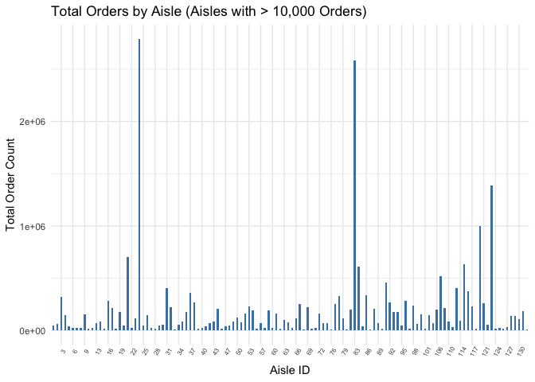

p8105_hx3_jx562
================
Jingyi
2023-10-11

``` r
library(tidyverse)
```

    ## ── Attaching core tidyverse packages ──────────────────────── tidyverse 2.0.0 ──
    ## ✔ dplyr     1.1.3     ✔ readr     2.1.4
    ## ✔ forcats   1.0.0     ✔ stringr   1.5.0
    ## ✔ ggplot2   3.4.3     ✔ tibble    3.2.1
    ## ✔ lubridate 1.9.2     ✔ tidyr     1.3.0
    ## ✔ purrr     1.0.2     
    ## ── Conflicts ────────────────────────────────────────── tidyverse_conflicts() ──
    ## ✖ dplyr::filter() masks stats::filter()
    ## ✖ dplyr::lag()    masks stats::lag()
    ## ℹ Use the conflicted package (<http://conflicted.r-lib.org/>) to force all conflicts to become errors

## Problem 1

This problem aims to explore `instacart` data.

First, we loaded the data.

``` r
library(p8105.datasets)
data("instacart")
```

The data `instacart` has features as described below.

- The data has 15 observations and 1384617 variables.
- The data has variables named order_id, product_id, add_to_cart_order,
  reordered, user_id, eval_set, order_number, order_dow,
  order_hour_of_day, days_since_prior_order, product_name, aisle_id,
  department_id, aisle, department.
- An example of the observations of the data is demonstrated below.

``` r
head(instacart, 3)
```

    ## # A tibble: 3 × 15
    ##   order_id product_id add_to_cart_order reordered user_id eval_set order_number
    ##      <int>      <int>             <int>     <int>   <int> <chr>           <int>
    ## 1        1      49302                 1         1  112108 train               4
    ## 2        1      11109                 2         1  112108 train               4
    ## 3        1      10246                 3         0  112108 train               4
    ## # ℹ 8 more variables: order_dow <int>, order_hour_of_day <int>,
    ## #   days_since_prior_order <int>, product_name <chr>, aisle_id <int>,
    ## #   department_id <int>, aisle <chr>, department <chr>

Then, we need to answer a few questions regarding the dataset.

1.  How many aisles are there, and which aisles are the most items
    ordered from?

- There are 134 different aisles.

``` r
aisle_order = instacart |>
  group_by(aisle) |>
  summarize(order_number_aisle = sum(order_number)) |>
  arrange(desc(order_number_aisle))
```

- The aisle where most items are ordered from and the number of order
  are fresh fruits, 2787084.

2.  Make a plot that shows the number of items ordered in each aisle,
    limiting this to aisles with more than 10000 items ordered.

``` r
aisle_order_10000 = instacart |>
  group_by(aisle_id) |>
  summarize(order_number_aisle = sum(order_number)) |>
  filter(order_number_aisle > 10000)

ggplot(aisle_order_10000, aes(x = reorder(aisle_id, -order_number_aisle), y = order_number_aisle)) +
  geom_bar(stat = "identity", fill = "steelblue",  width = 0.5) +
  labs(x = "Aisle ID", y = "Total Order Count", title = "Total Orders by Aisle (Aisles with > 10,000 Orders)") +
  theme_minimal() +
  theme(axis.text.x = element_text(angle = 60, hjust = 1, size = 4)) 
```

<!-- --> \*
Given the aisle id, we can look up to the exact aisle name. There are
122 out of 134 which has an order number larger than 10000. The aisles
with top 5 total order number count are fresh fruits, fresh vegetables,
packaged vegetables fruits, yogurt, packaged cheese

3.  Make a table showing the three most popular items in each of the
    aisles “baking ingredients”, “dog food care”, and “packaged
    vegetables fruits”. Include the number of times each item is ordered
    in your table.
